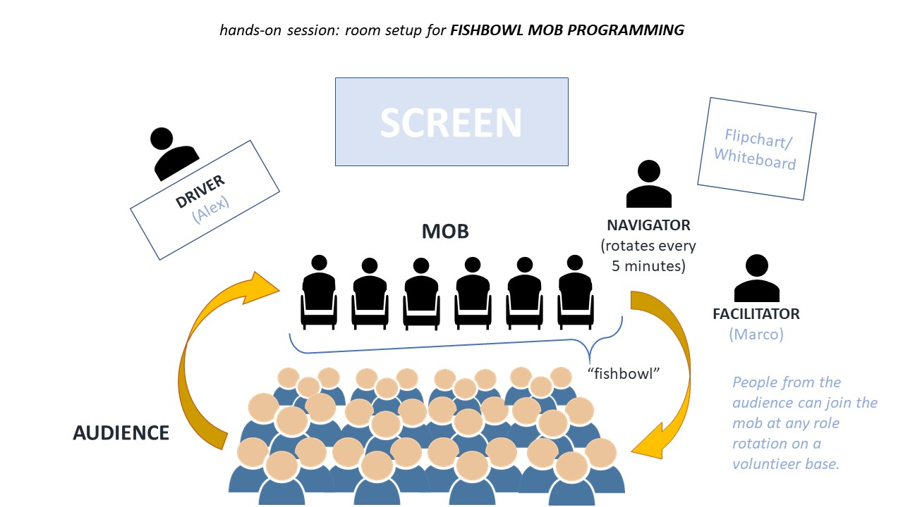

# Battleship Kata — Working Software 2026 Conference Workshop

> Before AI, a feature took days. With AI and no discipline, it takes hours but breaks in production.
> With nWave, it takes hours and it works.

## What this is

A 3-hour mob programming workshop. You pick a user story from a real backlog, implement it on a live system using AI-assisted development with the nWave methodology, and ship it to production. Or you figure out exactly why you didn't make it. Both outcomes are worth the session.

The vehicle is a multiplayer Battleship game. The real lesson is what happens when you put 20+ specialised AI agents on a real codebase with real constraints.

---

## The setup

The game already exists and is already deployed. Players can log in, create rooms, join each other, deploy fleets, and fire shots. Your job is not to build the game — it is to extend it.

The codebase follows a ports-and-adapters architecture:

- **`battleship-kata-web`** — ASP.NET Core 8 MVC, controllers, session, views
- **`battleship-kata-app`** — pure domain: services, ports, models, MongoDB adapter
- **`battleship-kata-tests`** — xUnit acceptance tests, unit tests, ArchUnitNET dependency rules

State lives in MongoDB. The game UI (HTML + vanilla JS) is frozen and authoritative. Your backend must match what `store.js` expects, down to the `"x,y"` shot key format.

---

## The backlog

Six user stories, each building on the previous:

| # | Story | What it unlocks | Status |
|---|-------|-----------------|--------|
| US-01 | Create a Room | A player creates a game and gets a 4-letter code | pre-built |
| US-02 | Join a Room | A second player joins using the code | pre-built |
| US-03 | Live View | Facilitator projector shows all games in real time | pre-built |
| US-04 | Deploy Fleet | Both players place ships and ready up; battle begins atomically | yours to build |
| US-05 | Fire a Shot | Turn-based firing with server-side hit detection | yours to build |
| US-06 | Game End | Last ship sunk transitions the room to finished with a winner | yours to build |

The walking skeleton (login, player persistence, session, MongoDB wiring) and US-01, US-02, US-03 are already implemented and tested. You start from US-04.

---

## The methodology: nWave

nWave guides you through every phase with specialised AI agents:

- **DISCUSS** — JTBD analysis, user story authoring, acceptance criteria
- **DESIGN** — architecture decisions, C4 diagrams, technology selection
- **DISTILL** — executable acceptance tests in Given-When-Then format
- **DELIVER** — Outside-In TDD: red, green, refactor, commit

Every agent has a paired reviewer agent that challenges its output. Code that "looks right" is the most dangerous kind. The reviewer is there to catch it before you commit.

---

## Prerequisites

- .NET 8 SDK
- MongoDB connection string (provided by the facilitator on the day)
- Claude Code CLI: `npm install -g @anthropic-ai/claude-code@stable`
- nWave: `npm install -g nwave-ai@stable`
- Git

Clone this repo and verify the build:

```bash
git clone git@github.com:Alcor-Academy/battleship-kata-workshop-template.git
cd battleship-kata-workshop-template
dotnet build
dotnet test
```

All 51 tests should pass before the session starts.

---

## Running locally

```bash
cd battleship-kata-web
dotnet run --launch-profile http
```

Opens at `http://localhost:5100`. Log in with any name to reach the lobby.

The `solution-done` branch contains the reference implementation if you want to see where the kata ends up.

---

## How the workshop runs

Depending on the number of participants with Claude Code available, the session runs as a **mob** or as a **fishbowl mob**.



In a **fishbowl mob**, a small active group (Driver, Navigator, mob members) works at the screen while the rest of the audience observes. Anyone from the audience can volunteer to join the mob at the next role rotation. The facilitator keeps time and guides the process.

Regardless of format, the flow is the same:

1. Pick a user story from the backlog
2. Run `/nw-discuss` to analyse and refine the story
3. Run `/nw-design` if the story needs architectural decisions
4. Run `/nw-distill` to generate acceptance tests
5. Run `/nw-deliver` to implement under TDD with AI agents
6. Tests green, architecture rules pass, deploy

Three hours. One feature. Real production.

---

## The constraint that makes it real

`game.js` is frozen. You cannot touch it. The C# game logic in `GameLogicService` must replicate it exactly — same hit detection, same sunk condition, same fleet-destroyed check — or the client and server will diverge silently and the wrong player will win.

That tension is the point.

---

*Workshop designed by Alessandro Di Gioia and Marco Consolaro for Working Software Conference 2026.*
